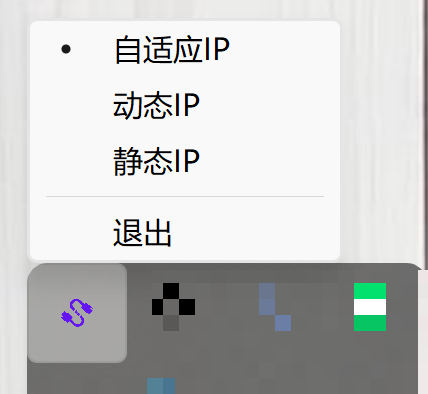

# RouterSwitcher - Router Switching Tool

An intelligent network IP configuration switching tool that automatically switches between static IP and dynamic IP configurations based on network environment.

## 📋 Project Introduction

RouterSwitcher is a desktop application developed with Wails v3, primarily designed to automatically manage network IP configurations on Windows systems. When you connect to your home network, the application can automatically switch to static IP configuration to use a bypass router; when connecting to other networks, it automatically switches back to dynamic IP (DHCP) mode, ensuring flexibility and convenience in network connectivity.

**Typical Use Case**: Connect to your bypass router via gateway in home local area network; use dynamic IP (DHCP) mode when on external networks.

## ✨ Key Features

- **Three IP Modes**
  - **Adaptive Mode**: Automatically switches IP configuration based on network environment
  - **Dynamic IP Mode**: Forces DHCP to automatically obtain IP
  - **Static IP Mode**: Forces static IP configuration

- **Intelligent Network Detection**
  - Automatically detects currently connected WiFi SSID
  - Detects bypass router reachability (via ping detection)
  - Automatically checks network status every 30 seconds (only in adaptive mode)

- **System Tray Support**
  - Runs minimized to system tray
  - Quick IP mode switching via tray menu
  - Click tray icon to show/hide main window

- **Auto Start**
  - Supports setting automatic startup on boot
  - Implemented using Windows Task Scheduler

- **Configuration Management**
  - Graphical configuration interface
  - Real-time network status display
  - Configuration automatically saved to local file

### Interface Demo


### System Tray




## 🛠️ Tech Stack

- **Backend**: Go 1.24+
- **Frontend**: Vue 3 + Vite
- **Framework**: Wails v3
- **Platform**: Windows (currently only supports Windows systems)

## 📦 System Requirements

- Windows 10/11
- Administrator privileges (required for modifying network configuration)
- Location service permissions (required for obtaining WiFi SSID information)

## 🚀 Installation and Usage

### Build from Source

1. **Clone the repository**
   ```bash
   git clone <repository-url>
   cd RouterSwitcher
   ```

2. **Install dependencies**
   ```bash
   # Install Go dependencies
   go mod download
   
   # Install frontend dependencies
   cd frontend
   npm install
   cd ..
   ```

3. **Run in development mode**
   ```bash
   wails dev
   ```

4. **Build executable**
   ```bash
   wails build
   ```
   After building, the executable file will be located in the `build/bin/` directory.

### Usage Instructions

1. **First Run**
   - After running the program, a `config.json` configuration file will be generated in the program directory
   - Default configuration:
     - IP Mode: Adaptive
     - Home SSID: `HomeWiFi`
     - Static IP: `192.168.31.100`
     - Gateway: `192.168.31.2`
     - DNS: `192.168.31.2`

2. **Configuration Settings**
   - Click the system tray icon to open the configuration interface
   - Modify configuration according to your network environment:
     - **Network using static IP mode (SSID)**: Enter your home WiFi name
     - **Static IP Configuration**: Set static IP address, gateway, and DNS server address
     - **IP Mode**: Select adaptive/dynamic IP/static IP mode
     - **Auto Start**: Check to automatically run the program on system startup
   - Click the "Save" button to save configuration, which will take effect immediately

3. **System Tray Operations**
   - **Right-click** the tray icon to quickly switch IP modes (adaptive/dynamic IP/static IP)
   - **Left-click** the tray icon to show/hide the main window
   - Select "Exit" to close the program

## ⚙️ Configuration

The configuration file `config.json` is located in the same directory as the program executable, with the following format:

```json
{
  "HomeSSID": "YourWiFiName",
  "StaticIP": "192.168.31.100",
  "Gateway": "192.168.31.2",
  "DNS": "192.168.31.2",
  "AutoStart": false,
  "IPMode": "adaptive"
}
```

### Configuration Items

- `HomeSSID`: Home WiFi SSID name. When connected to this WiFi, adaptive mode will attempt to switch to static IP configuration
- `StaticIP`: Static IP address. Ensure this IP address is not occupied in your local network
- `Gateway`: Gateway address (usually the IP address of the bypass router)
- `DNS`: DNS server address, can be a single address or multiple addresses (separated by commas)
- `AutoStart`: Whether to auto-start on boot (`true`/`false`)
- `IPMode`: IP mode selection
  - `adaptive`: Adaptive mode (recommended), automatically switches based on network environment
  - `dynamic`: Dynamic IP mode, forces DHCP to obtain IP
  - `static`: Static IP mode, forces the configured static IP

## 🔧 How It Works

### Adaptive Mode Workflow

1. After program startup, automatically checks network status every 30 seconds (only in adaptive mode)
2. Detects whether the currently connected WiFi SSID matches the configured `HomeSSID`
3. If SSID matches, uses ping command to detect whether the bypass router (gateway address) is reachable
4. If both conditions are met, the program automatically switches to static IP configuration
5. If either condition is not met, the program automatically switches back to dynamic IP (DHCP) mode

### Network Detection Mechanism

- **WiFi SSID Detection**: Uses Windows system's `netsh wlan show interfaces` command to obtain currently connected WiFi information
- **Bypass Router Reachability Detection**: Uses system ping command to detect whether the gateway address is reachable (timeout: 3 seconds)
- **Network Interface Detection**: Automatically detects active network interfaces, supports both Chinese and English Windows environments

## ⚠️ Important Notes

1. **Administrator Privileges**
   - Modifying network configuration requires administrator privileges. It is recommended to run the program as administrator
   - If privileges are insufficient, IP switching operations may fail

2. **Location Service Permissions**
   - Windows system needs location services enabled to obtain WiFi SSID information
   - If location services are disabled, the program will prompt you to enable them
   - How to enable: Windows Settings → Privacy & Security → Location → Enable location services

3. **Network Interface**
   - The program automatically detects active network interfaces
   - If detection fails, please check whether the network connection is normal

4. **Configuration File**
   - Configuration file is saved in the same directory as the program executable
   - If the configuration file is corrupted, the program will use default configuration and recreate the configuration file

## 📝 Development

### Project Structure

```
RouterSwitcher/
├── main.go              # Main program entry and Wails application logic
├── config.go            # Configuration file read/write
├── autostart.go         # Auto-start management
├── network.go           # Network interface and IP configuration management
├── types.go             # Data structure definitions
├── wails.json           # Wails configuration file
├── go.mod               # Go module dependencies
├── frontend/            # Frontend code
│   ├── src/
│   │   ├── main.js      # Frontend entry
│   │   └── components/
│   │       └── ConfigManager.vue  # Configuration management component
│   ├── package.json     # Frontend dependencies
│   └── vite.config.js   # Vite configuration
└── build/               # Build-related files
```

### Development Commands

```bash
# Development mode (hot reload)
wails dev

# Build production version
wails3 task release

# Build development version (uncompressed)
cd frontend
npm run build:dev
```

### Log Files

The program generates an `app.log` log file during runtime, located in the same directory as the program executable, which can be used for troubleshooting.

## 📄 License

This project is licensed under the MIT License.

## 👤 Author

- **Nisus Liu** - 609069481@qq.com

## 🙏 Acknowledgments

- [Wails](https://wails.io/) - Excellent Go desktop application framework
- [Vue.js](https://vuejs.org/) - Progressive JavaScript framework
- [Vite](https://vitejs.dev/) - Next-generation frontend build tool

## 📮 Feedback and Support

If you have any questions or suggestions, please contact us through:

- Email: 609069481@qq.com
- Submit an Issue or Pull Request

---

**Note**: Some system commands depend on location permissions. Please enable location permissions.


