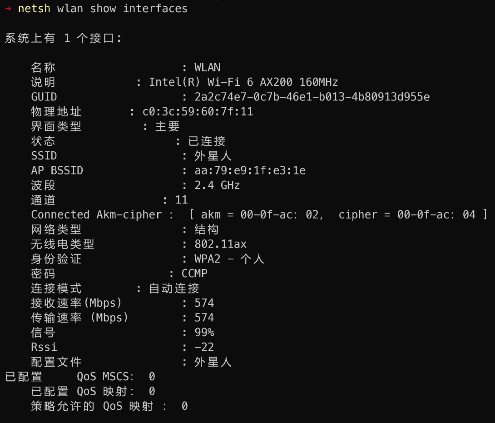

```
netsh wlan show interfaces
```



```
➜ netsh interface show interface

管理员状态     状态           类型             接口名称
-------------------------------------------------------------------------
已启用            已连接            专用               WLAN
```

上例接口名称"WLAN", 后面设置接口的ip, 这个作为参数之一.


```
"\r\n管理员状态     状态           类型             接口名称\r\n-------------------------------------------------------------------------\r\n已启用            已连接            专用               WLAN\r\n\r\n"
```

手动在终端执行命令

```
➜ netsh interface ip set address WLAN static 192.168.31.81 255.255.255.0 192.168.31.2

➜ netsh interface ip set dns WLAN static 192.168.31.1

配置的 DNS 服务器不正确或不存在。
```


```
➜ netsh interface ip show config WLAN

接口 "WLAN" 的配置
    DHCP 已启用:                          是
    IP 地址:                           10.206.219.69
    子网前缀:                        10.206.219.0/24 (掩码 255.255.255.0)
    默认网关:                         10.206.219.203
    网关跃点数:                       0
    InterfaceMetric:                      35
    通过 DHCP 配置的 DNS 服务器:      10.206.219.203
    用哪个前缀注册:                   只是主要
    通过 DHCP 配置的 WINS 服务器:     无
```


需要定位权限
```
➜ netsh wlan show interfaces

系统上有 1 个接口:
网络 shell 命令需要位置权限才能访问 WLAN 信息。在“隐私和安全设置”中的“位置”页上启用位置服务。

下面是“设置”应用中“位置”页的 URI：
ms-settings:privacy-location
若要在“设置”应用中打开“位置”页，请按住 Ctrl 键并选择相应链接，或运行以下命令：
start ms-settings:privacy-location

或者，若要从“运行”对话框打开“位置”页，请按 Windows 徽标键 + R，然后复制并粘贴上面的 URI。

功能 WlanQueryInterface 返回错误 5:
拒绝访问。
```