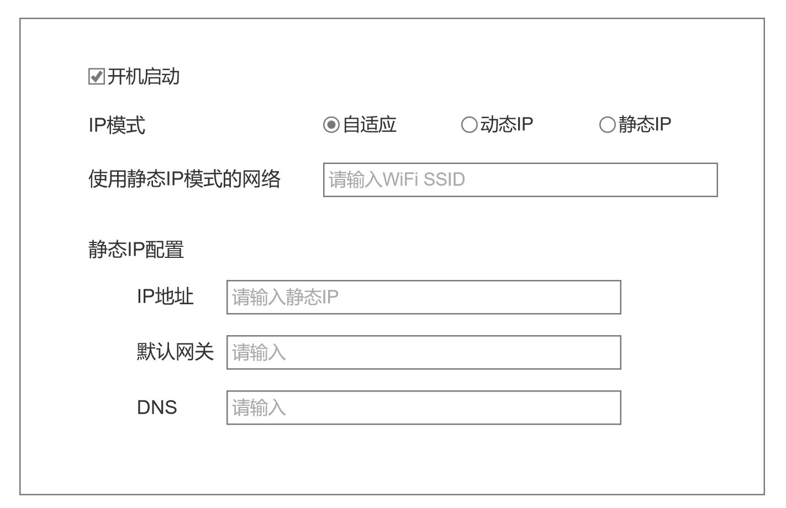

# 需求简介

开发一个小工具(暂时只用针对windows系统)：

- 当检测到连接到家庭局域网时并且旁路由可达时, 自动修改ip地址和网关配置, 让其走旁路由. 当检测到不是家庭局域网时, 切回自动获取ip等配置。
- 带系统托盘图标，可右键，可单击，可双击，可调出设置界面，用户配置自定义参数。
- golang语言实现，打包成可安装程序。

## 路由智能切换逻辑

> 1. 检测当前是否连接到 **家庭局域网（如 SSID 或 IP 段）**
> 2. 如果是 → 检测旁路由（192.168.31.2）是否可达
>    * 可达 → 设置静态 IP + 网关 = 192.168.31.2 + DNS = 192.168.31.2
>    * 不可达 → 切回自动获取（DHCP）
> 3. 如果不是家庭局域网 → 强制切回自动获取
> 4. 后台常驻，自动监听网络变化（如 Wi-Fi 切换、插拔网线）

```
[Windows 设备]
   ↓ 检测当前网络
   ├─ 是家庭局域网（如 SSID="HomeWiFi"）→ ping 192.168.31.2
   │     ├─ 成功 → 设置静态 IP: 192.168.31.x, 网关: 192.168.31.2, DNS: 192.168.31.2
   │     └─ 失败 → 设置为自动获取（DHCP）
   └─ 不是家庭局域网 → 设置为自动获取
```

## 用户设置

1. 系统托盘图标，右键弹出菜单，
2. 单击，显示用户配置界面


## 原型图

### 托盘图标右键菜单

托盘图标右键菜单:

1. 自适应IP: 即自动根据当前网络环境自动切换动态IP还是静态IP
2. 动态IP: 即DHCP
3. 静态IP: 使用配置的IP等参数
4. 退出: 即退出程序


### 配置页



- 开机启动，复选，勾选，则要开启本应用。
- IP模式切换
- 使用静态IP模式的网络
- 静态IP配置
  - IP地址
  - 默认网关
  - DNS


"IP模式", 三选一, "自适应", "动态IP", "静态IP"

这个选项的改动和右键菜单里的选择等价, 且要联动. 

比如, 这里选了"动态IP", 托盘右键菜单"动态IP"也是显示勾选的. 同样, 托盘右键菜单选的"静态IP", 配置页也要显示"静态IP"被勾选

详细对照表：

| 配置页>“IP模式” | 托盘图标右键菜单 |
| --------------- | ---------------- |
| 自适应          | 自适应IP         |
| 动态IP          | 动态IP           |
| 静态IP          | 静态IP           |


