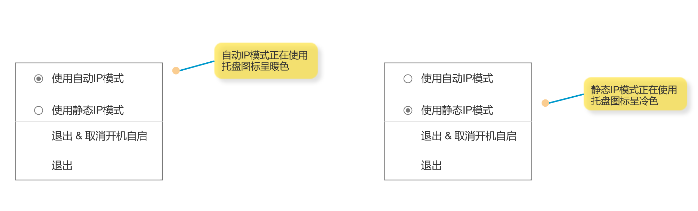

# 需求简介

开发一个小工具(暂时只用针对windows系统)：

- 当检测到连接到家庭局域网时并且旁路由可达时, 自动修改ip地址和网关配置, 让其走旁路由. 当检测到不是家庭局域网时, 切回自动获取ip等配置。
- 带系统托盘图标，可右键，可单击，可双击，可调出设置界面，用户配置自定义参数。
- golang语言实现，打包成可安装程序。

## 路由智能切换逻辑

> 1. 检测当前是否连接到 **家庭局域网（如 SSID 或 IP 段）**
> 2. 如果是 → 检测旁路由（192.168.31.2）是否可达
>    * 可达 → 设置静态 IP + 网关 = 192.168.31.2 + DNS = 192.168.31.2
>    * 不可达 → 切回自动获取（DHCP）
> 3. 如果不是家庭局域网 → 强制切回自动获取
> 4. 后台常驻，自动监听网络变化（如 Wi-Fi 切换、插拔网线）

```
[Windows 设备]
   ↓ 检测当前网络
   ├─ 是家庭局域网（如 SSID="HomeWiFi"）→ ping 192.168.31.2
   │     ├─ 成功 → 设置静态 IP: 192.168.31.x, 网关: 192.168.31.2, DNS: 192.168.31.2
   │     └─ 失败 → 设置为自动获取（DHCP）
   └─ 不是家庭局域网 → 设置为自动获取
```

## 用户设置

1. 系统托盘图标，右键弹出菜单，
   1. 选项组1：提供切换功能：自动IP和静态IP模式来回切换, 提供两个单选项:
      1. 使用自动IP模式: 勾选后, 即切换为自动IP模式
      2. 使用静态IP模式: 勾选后, 即切换为静态IP模式
   2. 选项2：退出 & 取消开机启动.
   3. 选项2：退出功能，点击，即退出应用。
2. 单击，显示用户配置界面，
   1. 配置1：是否开机自启动
   2. 配置2：开启、关闭IP自动切换功能，关闭后，不会自动切换，需要手动切换
   3. 配置3：静态IP模式切换条件，提示输入WiFi SSID，检测到连接的是该网络时切换为静态IP模式
   4. 配置4：静态IP相关参数设置区域
      1. 字段1：IP地址
      2. 字段2：网关
      3. 字段2：DNS


## 原型图


### 托盘图标右键菜单




### 配置页


