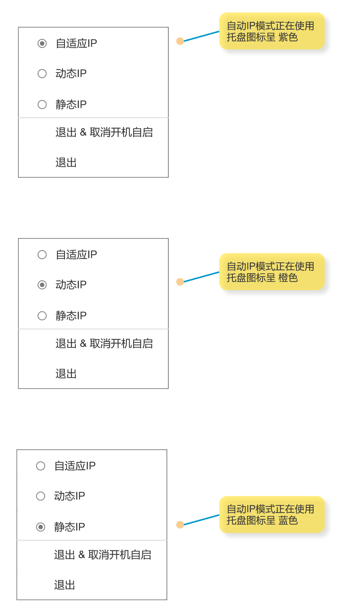
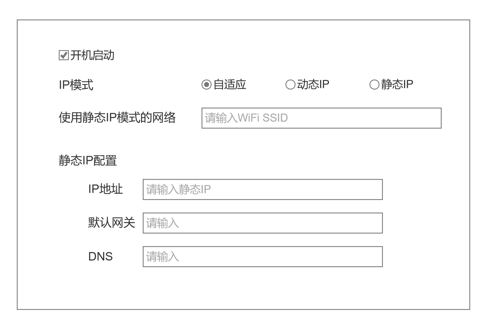

## 托盘右键菜单

托盘图标右键菜单调整为:

1. 自适应IP: 即自动根据当前网络环境自动切换动态IP还是静态IP
2. 动态IP: 即DHCP
3. 静态IP: 使用配置的IP等参数

## 配置页

如下图, 主要改动点:

"IP模式", 三选一, "自适应", "动态IP", "静态IP"

这个选项的改动和右键菜单里的选择等价, 且要联动. 

比如, 这里选了"动态IP", 右键菜单"动态IP"也是现实勾选的. 同样, 右键菜单选的"静态IP", 配置页也要显示"静态IP"被勾选

